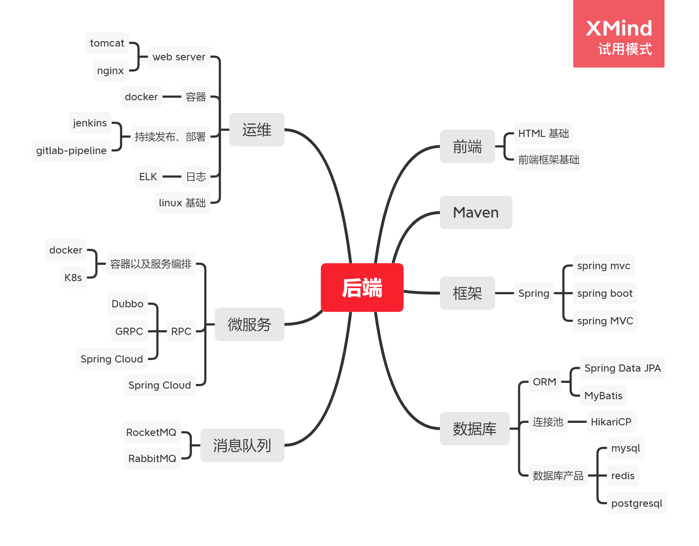

## Java 入门学习

提前说明: java 环境并不需要特意安装, idea 提供 java 环境的自动配置,包括 JDK 的下载.

关于 Java 这块的入门学习要比前端简单，但是工作难度不比前端低，而且效果上来说不是那么好。

和前端类似，Java 的学习基本都是建立在工具之上，常见的 Java EE/Java web （例如 servlet、jsp 等）、spring 
或者 Android framework 等各种工具。

目前来说，Java 主要服务的是服务端和 Android 开发，这里说的主要是后端为主，后端的话是  Java EE 为主导和 Spring 相关框架的知识。有些人
学习过 Java 发现可能和 C 一样，不知道 Java 是用于什么功能为什么受到重视，对于这个问题来说我们可以举例我们使用的操作系统，
操作系统里面所有使用的 APP 也好，软件也好，他们都不是直接去和硬件交互的，就例如你去写 java 代码也不是直接跑一段 main 函数去执行各种
后端服务的。所以对于 java 的开发和学习，我们需要了解自己应该会接触多少东西。

1. Servlet 规范以及 JDBC
    
    servlet 规范对于目前学习来说并没有特别大的意义，但是 Servlet 能让 Java 代码跑在实现了 servlet 规范的容器上（也就是常见的 Tomcat），
    这个决定了你的代码是不是能简单的作为一个能在互联网访问的应用，只要学会了就可以开始做一个常见能运行的后端服务。
    
    JDBC 是用于 Java 和数据进行访问操作的工具。
    
2. Spring 框架

    Spring 框架是目前企业级开发通用的框架，也是未来主要使用的框架，上面的基础可以不看，直接使用 spring 框架切入开发也没问题，但是往往在
    自主开发上面就要很难入手，所以为什么要学习基础的原因。Spring MVC 、Spring Data JPA / Mybatis 是目前通用的几个 Java 框架。
    
可能有些人认为后端要学这么多东西，实际上这个和公司的业务还差非常多，但是万变不离其宗，后端的本质是数据的存储和处理，从 C 学习过来的各种语句
已经能够进行数据处理了，比如从整个学校的数组里面查找过滤整个班级的的数据，最终都是在执行类似这种的逻辑，但是又难在怎么把效率提高，以及代码
复用性上去做更多的功夫。

##  思维导图

## Spring boot 框架

[SpringBoot2 零基础入门](https://www.bilibili.com/video/BV19K4y1L7MT)

对于目前的后端开发来说，上手比上什么都重要，首先学会 Spring boot 2 如何使用，并且能够运行。

spring boot 自带 maven 配置，保证在学习开发的过程中不会碰到 maven 相关的配置问题。如果有需要了解的，请继续学习下面的 Maven 配置。

如果涉及 Sql 的安装建议安装 [PostgreSql](https://www.postgresql.org/download/). 为什么不是 mysql 呢?
首先 Postgresql 性能也不差, 第二个 postgresql 安装更简单,更小巧, 更适合入门学习.

数据库管理工具用 IDEA 自带的 DATABASE 即可, [IntelliJ IDEA 连接 mysql 数据库](https://juejin.cn/post/6844904036802494477)

如果涉及前端开发相关的问题，请学习 [前端基础](../front-end/basic-learning.md)，或者跳过也行，但是最终前端后端不分离，
为了未来的工作计划，请安排好前端基础学习的计划。

## Maven

[Maven 教程 -- 廖雪峰](https://www.liaoxuefeng.com/wiki/1252599548343744/1309301146648610)

maven 是后端必备的技能，辅助后端进行项目管理和项目生命周期管理以及编译相关功能的工具，属于最底层需要学习使用的工具之一。

大家都知道 java 文件是可以用 javac 进行编译的，但是涉及各种项目管理，以及引用第三方代码如何进行编译管理，都是由 Maven 进行配合的。

前端也有类似的工具，npm 负责 前端 的包管理，但是打包需要自己另外学习各种打包工具，对于这方面，后端只需要学习 maven 还是比较简单的。

## linux 部署环境搭建

1. linux 服务器

    目前 linux 系统的分支比较多，目前推荐 Ubuntu 系统作为 linux 。
    
    建议大家使用 [阿里云](https://aliyun.com) 的 [轻量服务器](https://cloud.tencent.com/product/lighthouse) 来开发和部署,
    使用学生身份认证,就可以享受一个月 10 块钱的优惠.
    
2. Ubuntu 基础学习

    [Ubuntu使用基础](https://www.bilibili.com/video/av46253543/)
    
2. 安装 openJDK

    [在 Ubuntu 2020.04 上安装 Java](https://juejin.cn/post/6929006089409134599)
    
3. 安装 sql (postgreSql) 

    [ubuntu安装Postgresql](https://www.jianshu.com/p/c109af9fab35)

    
3. nginx (选学, 建议学)
    
    [如何在Ubuntu 18.04上安装Nginx](https://www.myfreax.com/how-to-install-nginx-on-ubuntu-18-04/)
    
    [Nginx 配置详解](https://www.runoob.com/w3cnote/nginx-setup-intro.html)

