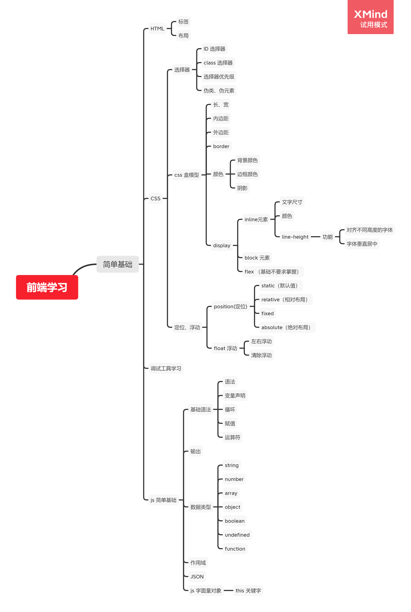

# HTML/CSS/JS基础

本章节主要是以最简单的基础来展开, 
HTML 是一种标记语言 , 能够标记网页元素的层次 ,
并且在 CSS 的作用下 , 能够展示出各种效果 , 例如各种丰富的效果 .

和常见的语言不一样的是 HTML 和 CSS 并不是一个看似可以被执行的代码 , 
它是一个描述网页元素的一种 "数据语言" , 这个数据语言在 `浏览器的解析和执行下`
产生了各种丰富的效果 . 

而 JavaScript 的效果是给予了浏览器能够动态改变 HTML/CSS
的能力 , 例如获取当前字体的颜色、大小，并且替换成另外一种颜色 。
 
JS 能够读取网页上渲染用的数据 ,就像 Java 能够读取当前各种系统数据一样 , 
浏览器给予 JS 足够多的权限和方法去修改数据从而导致了网页开始出现一种新的变革 .

所以对于刚开始学习 C、Java 的同学可能抱有疑问那些代码的作用，实际上来说对于
正式的开发更多是去利用工具、并且实现自己的效果，例如上面的获取字体的颜色、大小的过程是
先想办法获取到需要修改字体的数据 `var el = document.getElementBy('{element id}')` ; 
然后去读取字体数据, `var color = el.style.color;` ;
最后修改字体的颜色， `el.style.color = 'red'` 。 
至此这个元素的字体颜色就被修改了。是不是很简单？

上面的话仅仅是阐述 HTML 和 CSS 和 JS 之间的关系和作用 . 但是还是从下面的教程开始入门 HTML 吧。

## 思维导图

## HTML / CSS
 
1. 对于文档文字比较熟悉或者希望速成一点的同学

    1. [W3school - HTML 基础学习](https://www.w3school.com.cn/html/html_jianjie.asp)
    
        **HTML 基础教程** 和 **HTML 表单** 必须看完 , 
        但是 HTML 表单不需要看如何提交数据 , 初期理解比较麻烦而且未来并不会使用他们 .
        其他的请浏览即可 , 不需要知道如何使用 , 但是知道要能干什么 . 未来使用的时候可以回头来看 .
        
    2. [W3school - CSS 基础学习](https://www.w3school.com.cn/css/css_jianjie.asp) 
    
        CSS 基础学习 , 只需要看完 **CSS 基础教程** 和 **CSS 中级教程** 基础教程即可 , 内容虽然看起来挺多的
        但是基本分为以下几个部分: 
        
        1. 选择器
            
            规定了 CSS 规则对哪些 HTML 元素生效 , 以及伪类和伪元素
            
        2. 颜色 , 背景颜色 , 边框颜色.
        
        3. CSS 盒模型:  高(以及最大最小高度) , 宽(以及最大最小宽度) ,内边距 , 外边距 , 边框(及边框的宽度, 颜色) . 
        display 属性(决定了展示和布局的属性, 例如 block 和 inline), 重点是 block , inline 和 flex 三个功能
        
        4. 文字: 尺寸, 颜色, 对齐方式等(暂时只需要知道这些)
        
        5. 定位以及浮动
        
2. 针对希望能够轻松学习的同学

    所有的视频全部使用 2倍速, 如果听不清稍微放慢一点就可以了

    * [b站 pink 老师](https://www.bilibili.com/video/BV14J4114768)
        
        * P1-P188 html 基础和部分 CSS 基础
        
        * P221 - P236 定位基础
        
        * P274 - P296 HTML5 和 CSS3 相关基础
        
        可能有些人感觉怎么 300 多 P 啊,学不完啊, 首先一个是这个系列视频普遍 5 分钟左右, 差不多 1500 分钟, 
        加上2倍速播放差不多 750 分钟, 那么算下来才十几个小时, 但是如果把自己自学的训练的时间算下来,时间应该要 * 3 左右
        但是学习完的同学记得重新看一下上面的网站浏览一下内容 , 进行查缺补漏 .
        
        剩下来的训练课程对于某些仍然感觉迷茫的同学再进行下一步的训练, 尝试给自己
             
## 调试工具学习

[bilibili](https://www.bilibili.com/video/BV14J4114768?p=92)

关于调试工具是一个非常重要的东西, 这里给一个视频能够更直观的学习调试工具的基础 , 未来会有更加详细的文章和教程.

## JS 相关

* [JavaScript 教程](https://www.w3school.com.cn/js/index.asp)

    因为具备 C语言 和 Java 基础，非重点章节请快速浏览，不需要花时间在对应的
    章节浪费过多的精力。

    开发过程中经常能碰到的是 60% 的知识点都碰不到，但是一旦碰到一定要直到用什么，
    方式能够解决开发过程中碰到的问题，对于不需要强制理解的需要理解这个功能是能干什么的，
    未来碰到问题之后可以很快翻文档去解决问题。

    下面列出需要重点理解的章节
  
    - [JavaScript 输出](https://www.w3school.com.cn/js/js_output.asp)
       
        实际上 JS 的输出功能并没有那么强大，甚至不能读取文件，这个是 JS 环境的权限限制的。
       
        为什么大家都喜欢用 Java 呢，Java 具备跨平台的兼容，他的 API 提供各种和系统交互的功能,
        JS 并不能做到，但是需要掌握的原因是调试需求，你需要在适当的时候输出各种值进行调试
      
    - [JavaScript 数据类型](https://www.w3school.com.cn/js/js_datatypes.asp)
       
    - [JavaScript Function](https://www.w3school.com.cn/js/js_functions.asp)
    
    - [String](https://www.w3school.com.cn/js/js_strings.asp)
        
        连同 [String Function](https://www.w3school.com.cn/js/js_string_methods.asp) 
        都是需要重点了解的
       
    - [Number](https://www.w3school.com.cn/js/js_numbers.asp)

        连同 [Number Function](https://www.w3school.com.cn/js/js_number_methods.asp)
        都是需要重点了解的
      
    - [Array](https://www.w3school.com.cn/js/js_arrays.asp)

        连同 [Array Function](https://www.w3school.com.cn/js/js_array_methods.asp)
        都是需要重点了解的
      
    - [JavaScript 作用域](https://www.w3school.com.cn/js/js_scope.asp)
    
    - [JavaScript JSON](https://www.w3school.com.cn/js/js_json.asp)
    
    - [JavaScript this 关键词](https://www.w3school.com.cn/js/js_this.asp)
    
    - [JS 对象](https://www.w3school.com.cn/js/js_object_definition.asp)
    
        js 对象一共有 **对象定义**、**对象属性**、**对象方法**、对象访问器、**对象构造器**、对象原型和ECMAScript 5，
        这几个章节，只需要看加重字体的几个章节，未来会选个时间进行讲解
      

## 结束

简单的基础就到这里了，下次会学习一些和网页交互的方式。